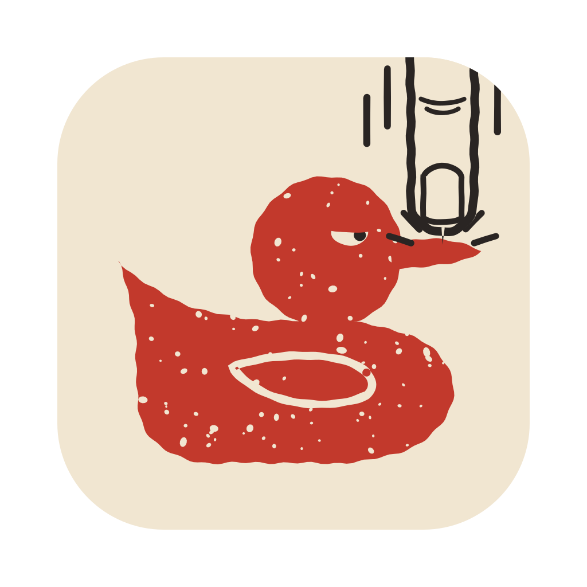

<p align="center">
  
</p>

<h1 align="center">ShutTheDuckOff</h1>

<p align="center">
  Keeps your music and movies at full volume while you are on a call.<br>
  A small menu bar app for macOS.
</p>

<p align="center">
  <a href="https://github.com/anegoda1995/ShutTheDuckOff/actions/workflows/ci.yml"></a>
  <a href="https://github.com/anegoda1995/ShutTheDuckOff/releases/latest"></a>
  
  <a href="LICENSE"></a>
</p>

## Why

As soon as a call starts (FaceTime, SharePlay, Zoom, Teams, a call in the browser), macOS turns every other app
down. This is called *ducking*. With SharePlay or a shared screen it gets worse: the movie you are watching together
drops every time somebody laughs. There is no setting to switch it off.

ShutTheDuckOff switches it off. While a call is running, other apps keep their volume. When there is no call, the app
does nothing at all.

## Install

**From a release** (Apple Silicon and Intel, macOS 14.2 or later):

1. Download `ShutTheDuckOff-<version>.zip` from [Releases](https://github.com/anegoda1995/ShutTheDuckOff/releases/latest) and unzip it.
2. In Terminal, run `./install.sh` from the unzipped folder. It copies the app to `/Applications`, starts it at login
   and, if VLC is installed, adds the VLC plugin (see below).
3. macOS asks for **System Audio Recording**. Allow it.

The builds are not notarized, which is why `install.sh` removes the quarantine flag from the app. If you prefer to do
it by hand: move the app to `/Applications` and open it with right click > Open (on macOS 15: System Settings >
Privacy & Security > Open Anyway).

**From source** (the Command Line Tools are enough, `xcode-select --install`):

```sh
git clone https://github.com/anegoda1995/ShutTheDuckOff.git
cd ShutTheDuckOff
make install
```

`make` alone builds `build/ShutTheDuckOff.app` and the VLC plugin, `make dist` packs a release zip.

## Use

The app lives in the menu bar:

| Icon | Meaning |
| --- | --- |
| the duck | waiting for a call |
| a finger on the duck's bill | a call is running, other apps are protected |
| the duck asleep | switched off, or no System Audio Recording permission |

A call is any app that uses a microphone. Dictation and Siri are ignored. If some other app keeps the microphone open
without being a call, add it to the ignore list (a bundle ID prefix or a process name):

```sh
defaults write io.github.anegoda1995.shuttheduckoff IgnoredApps -array "com.example.Recorder" "SomeTool"
```

`scripts/status.sh` shows whether everything is installed and running, and what the app did last.

## How it works

The audio server never ducks a process that holds a duck request of its own. ShutTheDuckOff uses that:

1. It notices a call the moment an app opens a microphone.
2. It creates a Core Audio process tap on the output device for every app except the call itself. The tap mutes those
   apps and hands their sound to ShutTheDuckOff.
3. ShutTheDuckOff plays the sound back to the same device while holding a duck request of 0.999 (-0.01 dB).
   The call can duck the original apps as much as it likes, they are muted anyway. The replay is not ducked.
4. A few seconds after the call ends, the tap is removed and the apps play directly again. The same happens if
   ShutTheDuckOff quits or crashes.

**VLC plugin.** VLC can hold the duck request itself, so it does not need the tap at all: no extra latency, and no
echo when you share the whole screen. `install.sh` puts `libnoduck_plugin.dylib` into
`~/Library/Application Support/ShutTheDuckOff/vlc-plugins` and adds `noduck` to VLC's control interfaces. VLC.app itself is
not modified. The plugin needs VLC 3.0.

## Trade-offs

- Apps that go through the tap play about 0.1 s later than usual, only during calls.
- When a call starts there is about 0.1 s of silence while the tap takes over.
- During a call, an app that starts playing sound takes about 0.2 to 0.3 s longer to start.
- If you share your **whole screen** in a call, your partner hears the tapped apps twice (about 0.1 s apart).
  Share a window instead, or play the video in VLC with the plugin.

## Privacy

A process tap is what macOS calls "System Audio Recording", hence the permission. The sound goes from the tap
straight back to your speakers or headphones. Nothing is recorded, stored or sent anywhere, and the app makes no
network connections.

## Good to know

- While ShutTheDuckOff protects other apps, macOS counts its tap as audio input. Tools that detect calls by watching
  the microphone (call recorders, "on air" lights) may therefore see it as a call app. Add
  `io.github.anegoda1995.shuttheduckoff` to their ignore list.
- Dictation and Siri use the microphone without being a call; they are ignored.

## Uninstall

Run `./uninstall.sh` from the release folder, or `make uninstall` in the source tree. It removes the app, the login
agent, the VLC plugin and its VLC setting, and resets the permission.

## Caveats

ShutTheDuckOff relies on `AudioDeviceDuck`, a Core Audio function that is exported but not documented (Chromium and
WebKit call it too, for example to undo ducking), and asks for the permission through the private TCC framework,
because macOS has no public API for that prompt (the open-source AudioCap sample does the same). Both work on
macOS 15 (tested on 15.7; 14.2 is the minimum for process taps), but a future macOS may change them. This is also why the app is not in the App Store.

## Contributing

Pull requests go to the `dev` branch. `main` only changes through a `dev` -> `main` pull request, which is a
release: it gets a `vX.Y.Z` tag, and CI builds the release zip from it.

## License

[GPL-3.0-or-later](LICENSE). You may use, study, share and change the code. If you distribute it, changed or not,
you must do so under the same license and with the source code.

ShutTheDuckOff is not affiliated with Apple or VideoLAN. FaceTime, SharePlay and macOS are trademarks of Apple Inc.,
VLC is a trademark of VideoLAN.
